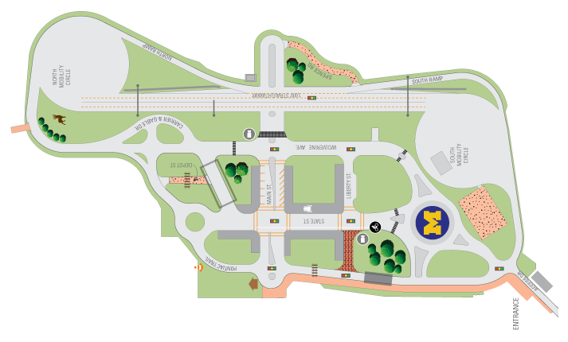
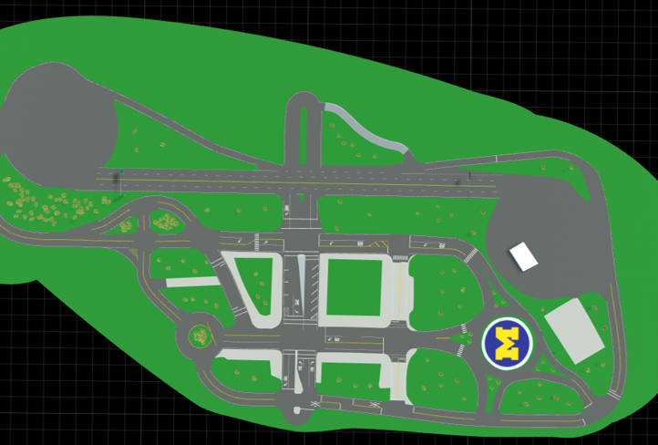
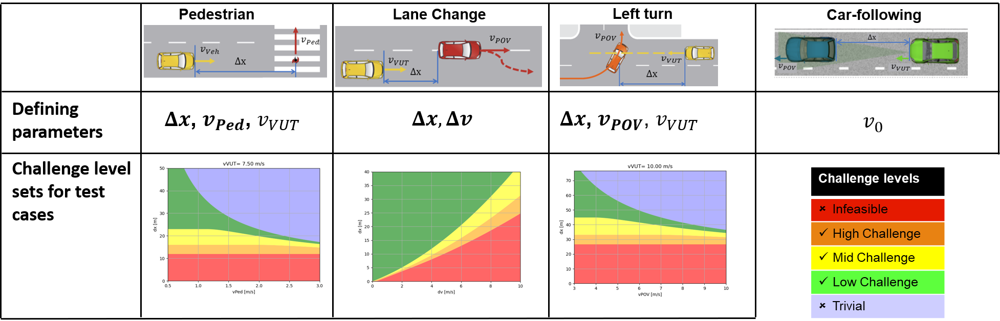
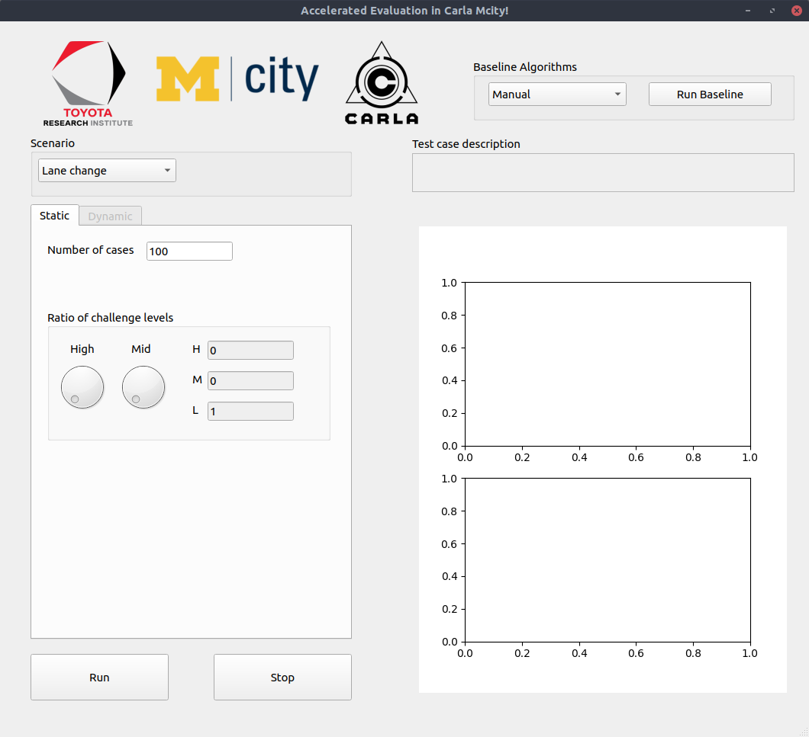
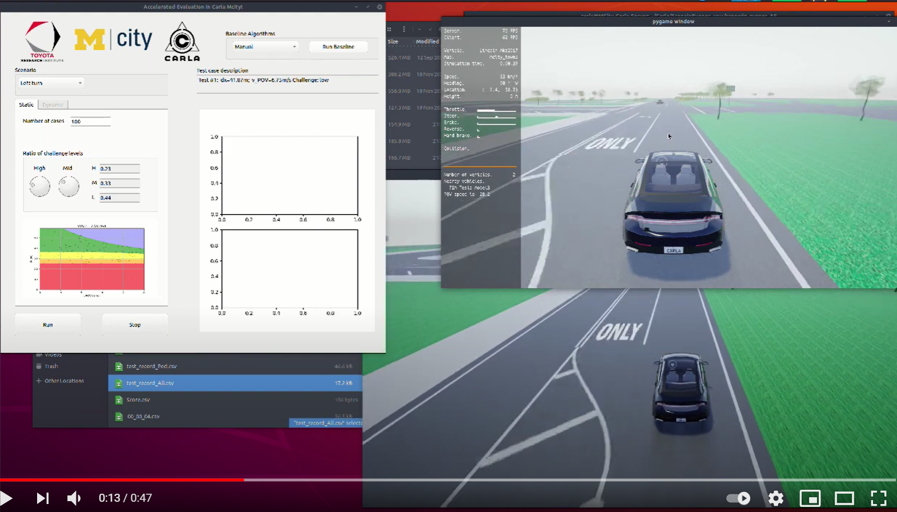

# Accelerated Evaluation in Carla Mcity

## Goals

The goal of this work is to make the accelerated evaluation schemes and tools available in the Carla simulator.

## Overview
For each scenario, two agents are involved, one is the vehicle under test (VUT), which will be controlled by the baseline algorithms or the user's algorithm; the other is the primary other vehicle(POV)/pedestrian, whose behavior is designed and controlled to create a specific driving challenge to the VUT. For scenarios are considered in this tool: Lane change, pedestrian crossing, left turn and car following, as shown below.  


## Components
### The Mcity Map
The challenge will be held inside the [Carla](https://carla.org/) virtual town of [Mcity](https://mcity.umich.edu/). Mcity is an 18-acre proving ground purposedly built for the testing of connected and automated vehicles, managed by the University of Michigan in Ann Arbor, Michigan. We built the Carla Mcity based on the true dimensions/layout of the real Mcity test facility, and it serves as just another virtual town for the Carla simulator. The supported Carla version is [0.9.9.4](https://github.com/carla-simulator/carla/tree/0.9.9.4). To learn more about the Carla simulator, please check out the [official documentations](https://carla.readthedocs.io/en/latest/).



### Test case sampling
For each of the four scenario, test cases are defined with the following parameters which define the initial conditions,  where the bold ones are to be sampled by the software and the non-bold ones are to be determined by the user. For the first three scenarios, the software will sample test cases in the parameter space, which is decomposed into different challenge levels sets. To make sure all test cases are feasible and non-trivial for the VUT, Only cases in the high, medium and low challenge level sets will be tested. The ratio of test cases in each challenge level can be adjusted by the user.



### Simulation flow control
The execution of test case simulation is based on [ScenarioRunner](https://github.com/carla-simulator/scenario_runner), a traffic scenario definition and an execution engine for CARLA. During the test simulation, the POV/pedestrian will adjust its speed and timing against the motion of the VUT in real time such that the set initial condition of test cases can be realized accurately. 


### Baseline algorithm
We provide two options as the baseline controllers of the VUT. The first one is manual control, where the user may control the POV using the keyboard to experience the test case. The second one is called the ZZZ baseline, which is an open-source full-stack modular AV control platform and is available [here](https://gitlab.com/umvdl/zzz/zzz).

### The software interface


The GUI interface makes it easier for the user to run repeated simulation tests. All four test scenarios are supported. The user can launch the tests, monitor the test cases and results throught the GUI.

## Usage
### Usage of the software
First, launch the Carla server with Mcity Map loaded in the Carla simulator folder with the command: 
 ```bash
 ./CarlaUE4.sh
```
Then, in the folder Accelerated_Evaluation_srunner, set up the environmental variables by:
```bash
 export CARLA_ROOT=YOUR CARLA ROOT
 export PYTHONPATH=$PYTHONPATH:${CARLA_ROOT}/PythonAPI/carla/dist/carla-0.9.9-py3.6-linux-x86_64.egg:${CARLA_ROOT}/PythonAPI/carla/agents:${CARLA_ROOT}/PythonAPI/carla
```
Finally, Start the software by
```bash
 python3 gui_main.py 

```

### Usage of The software interface

1. The user may first choose difference scenarios for test; 
2. The number of test cases N can be specified; then the ratio of different challenge levels among all cases is determined using the scroll knobs;
3. To start scenario generation, press the "Run" button. To exit the programm anytime, press the "Stop" button.
4. Then, a figure will appear in the left bottom, showing all the generated test cases in the test parameter space, which has been decomposed into different challenge level sets represented with different colors. the N cases will be set up and executed one by one inside Carla. The user may start their our algorithm to control the VUT for the test case, or choose one of the baseline algorithm to control the VUT. If one baseline algorithm is picked, press "Run Baseline" to start the baseline algorithm. 
5. The text bar above the plot palatte shows the details of current test cases; The plot palatte shows the detailed test results of the previous case. 

If car-following test is selected, the only differences are on the left side of the GUI: the user may specify the initial speed of the POV, which will be the equalibrium car-following speed that the user wants to test.

Here is a video showing the usage of the software.
[](https://www.youtube.com/watch?v=v2iVXCJNu4o)


### Usage of the ZZZ platform
The installation procedure of the ZZZ platform can be found in the offical repository shown above. The branch for this particular software is "challenge/carla_mcity". To use ZZZ, ROS is required. After downloading the ZZZ, please first use "catkin_make" to compile the ZZZ before following the instructions in the repo. 

### Others
After each test run, a csv file is generated in the "/Results" folder named "test_record_(code for each scenario)", which records the real-time relative distance (in x direction) and the speed of both POV and VUT. You can access this data for future analysis. 

Code for each scenario: LC for lane change; LT for left turn; Ped for pedestrian crossing; CF for car-following.
<!-- - Bulleted
- List

1. Numbered
2. List

**Bold** and _Italic_ and `Code` text

[Link](url) and 
```

For more details see [GitHub Flavored Markdown](https://guides.github.com/features/mastering-markdown/).

### Jekyll Themes

Your Pages site will use the layout and styles from the Jekyll theme you have selected in your [repository settings](https://github.com/yyab/Accelerated-Evaluation-in-Carla-Mcity/settings). The name of this theme is saved in the Jekyll `_config.yml` configuration file.

### Support or Contact

Having trouble with Pages? Check out our [documentation](https://docs.github.com/categories/github-pages-basics/) or [contact support](https://support.github.com/contact) and we’ll help you sort it out. -->
