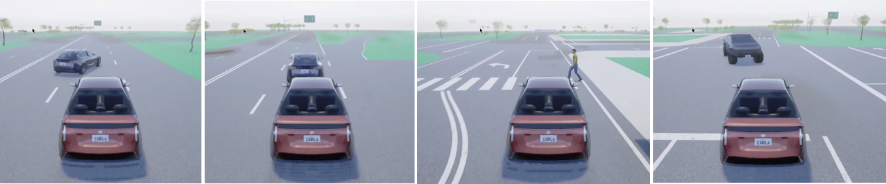
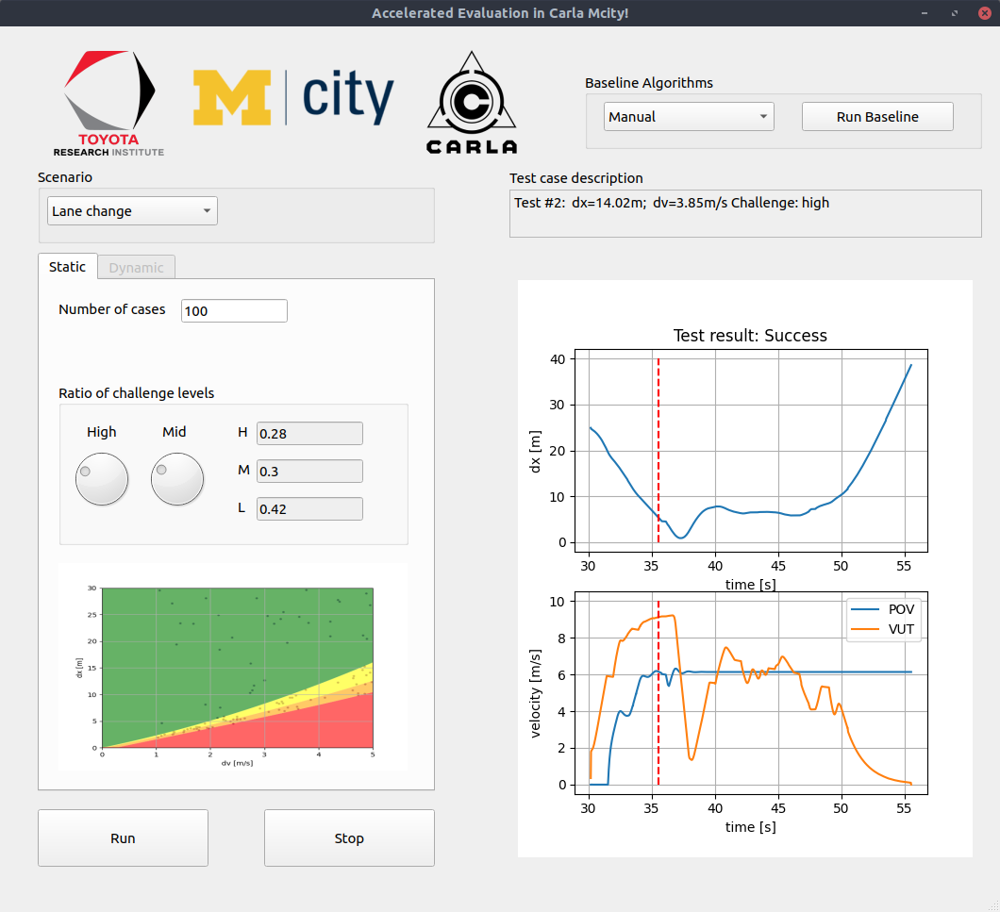

# Accelerated Evaluation in Carla Mcity

## Goals

The goal of this work is to make the accelerated evaluation schemes and tools available in Carla simulator.

## Overview
For each scenario, two agents are involved, one is the vehicle under test (VUT), which will be controlled by the baseline algorithms or the user's algorithm; the other is the primary other vehicle(POV)/pedestrian, whose behavior is designed and controlled to create a specific driving challenge to the VUT. For scenarios are considered in this tool: Lane change, pedestrian crossing, left turn and car following, as shown below.  


## Functionalities

### The software interface

The GUI interface makes it easier for the user to run repeated simulation tests. All four test scenarios are supported. For all except the car-following, the usage is the following: 
- The user may first choose difference scenarios for test; 
- The number of test cases N can be specified; then the ratio of different challenge levels among all cases is determined using the scroll knobs;
- To start scenario generation, press the "Run" button. To exit the programm anytime, press the "Stop" button.
- Then, a figure will appear in the left bottom, showing all the generated test cases in the test parameter space, which has been decomposed into different challenge level sets represented with different colors. the N cases will be set up and executed one by one inside Carla. The user may start their our algorithm to control the VUT for the test case, or choose one of the baseline algorithm to control the VUT. If one baseline algorithm is picked, press "Run Baseline" to start the baseline algorithm. 
- The text bar above the plot palatte shows the details of current test cases; The plot palatte shows the detailed test results of the previous case. 
If car-following test is selected, the only differences are on the left side of the GUI: the user may specify the initial speed of the POV, which will be the equalibrium car-following speed that the user wants to test.

### Test case sampling


### Simulation flow control


### Datalogging
Where are the previous test results stored. 

### Baseline algorithm
We provide two options as the baseline controllers of the VUT. The first one is manual control, where the user may control the POV using the keyboard to experience the test case. The second one is called the ZZZ baseline, which is an open-source full-stack modular AV control platform and is available [here](https://gitlab.com/umvdl/zzz/zzz).

## Usage
Markdown is a lightweight and easy-to-use syntax for styling your writing. It includes conventions for

```markdown
Syntax highlighted code block

# Header 1
## Header 2
### Header 3

- Bulleted
- List

1. Numbered
2. List

**Bold** and _Italic_ and `Code` text

[Link](url) and 
```

For more details see [GitHub Flavored Markdown](https://guides.github.com/features/mastering-markdown/).

### Jekyll Themes

Your Pages site will use the layout and styles from the Jekyll theme you have selected in your [repository settings](https://github.com/yyab/Accelerated-Evaluation-in-Carla-Mcity/settings). The name of this theme is saved in the Jekyll `_config.yml` configuration file.

### Support or Contact

Having trouble with Pages? Check out our [documentation](https://docs.github.com/categories/github-pages-basics/) or [contact support](https://support.github.com/contact) and we’ll help you sort it out.
